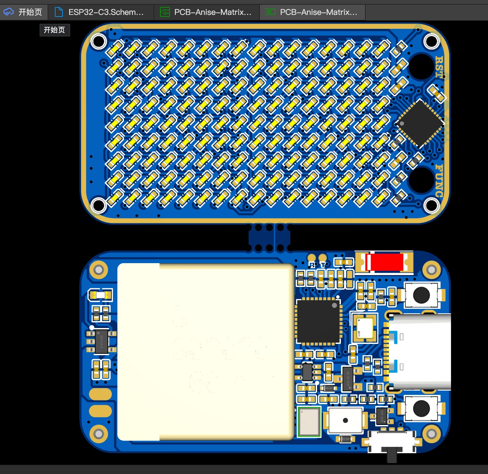

# AniseMatrixBadge
Anise Matrix Badge

* ESP32-C4FH4 With 4MB Flash
* 402020 Battery
* M1.2 screw x 4

# Pins

* IO0: I2C_SDA: 0
* IO1: I2C_SCL: 1
* IO3: VBAT / 2
* IO4: I2S_SCK
* IO5: Buzzer
* IO6: I2S_WS
* IO7: I2S_DIN
* IO9: BOOT

